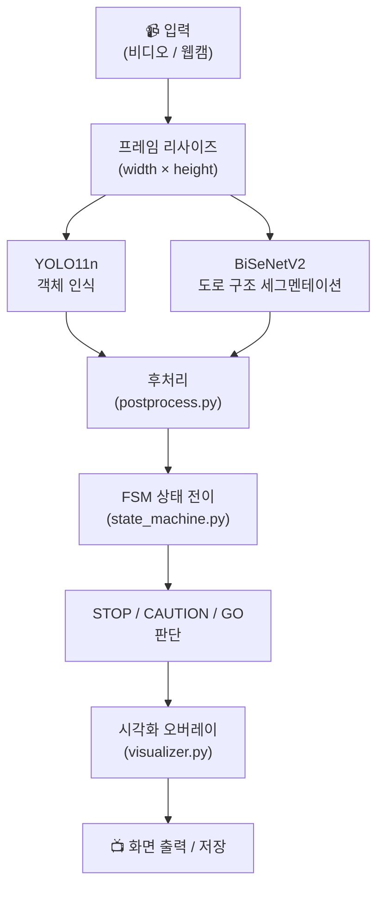
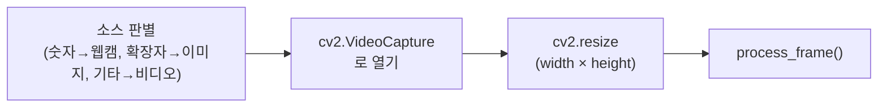
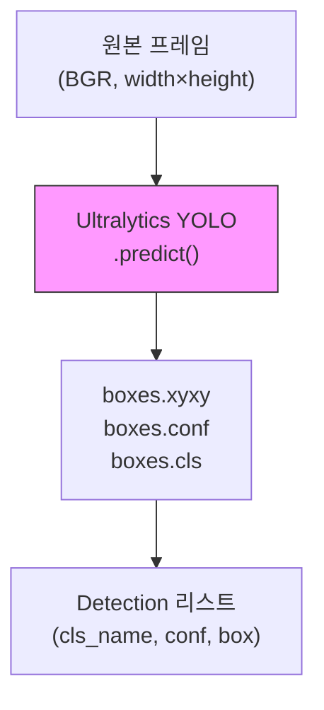
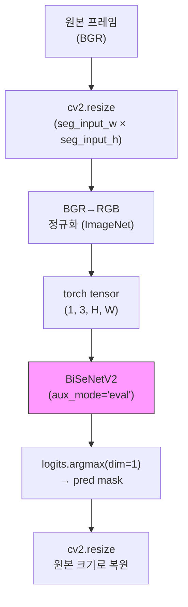
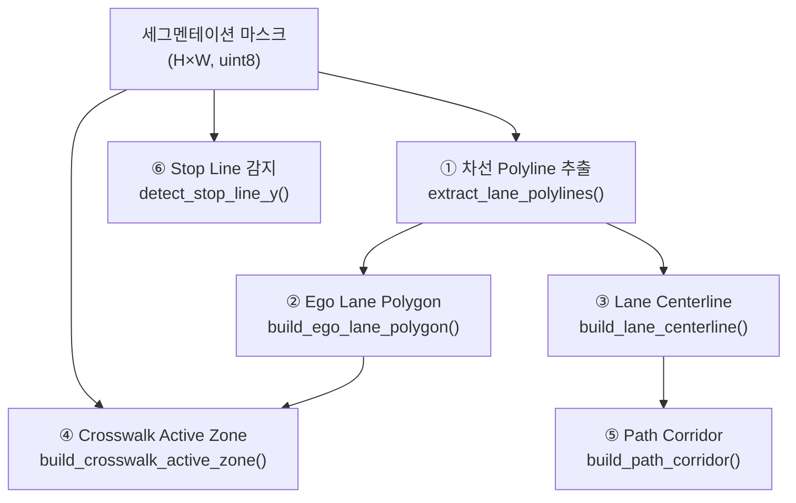
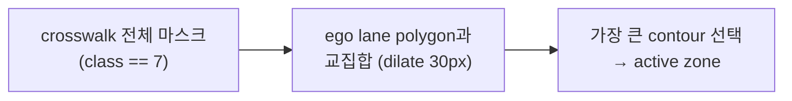
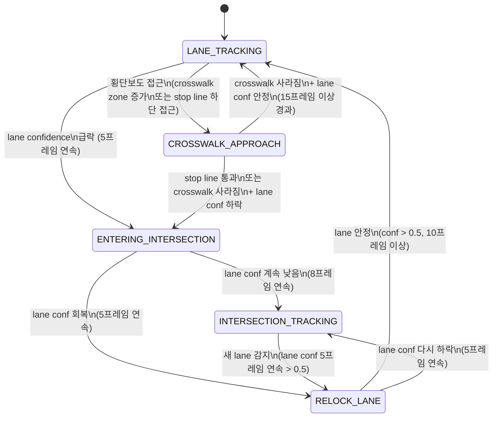
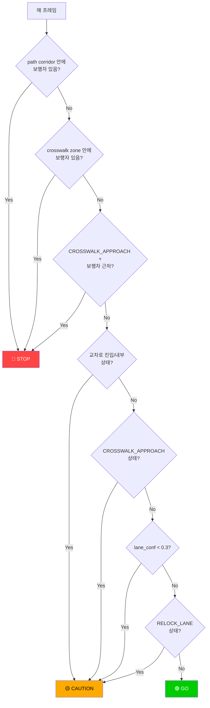
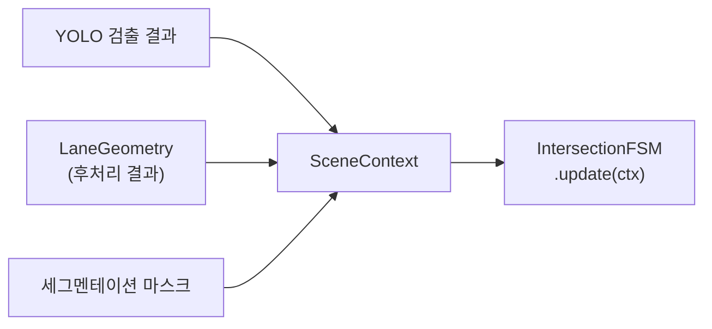

# Intersection Safety Demo — 동작 과정 상세 문서

## 1. 전체 파이프라인 개요



---

## 2. 파일별 역할

| 파일 | 모듈 | 핵심 역할 |
|------|------|-----------|
| [intersection_demo.py](file:///c:/Users/han02/Documents/SMU/4grade/capstone/intersection-safety-system/edge/inference/intersection_demo.py) | 메인 진입점 | 입력 읽기, 모델 로드, 메인 루프, 출력 저장 |
| [perception.py](file:///c:/Users/han02/Documents/SMU/4grade/capstone/intersection-safety-system/edge/inference/perception.py) | 모델 래퍼 | YOLO11n 검출 + BiSeNetV2 세그멘테이션 추론 |
| [postprocess.py](file:///c:/Users/han02/Documents/SMU/4grade/capstone/intersection-safety-system/edge/inference/postprocess.py) | 후처리 | ego lane, centerline, crosswalk zone, path corridor 생성 |
| [state_machine.py](file:///c:/Users/han02/Documents/SMU/4grade/capstone/intersection-safety-system/edge/inference/state_machine.py) | 상태 머신 | 5단계 FSM 전이 + STOP/CAUTION/GO 판단 |
| [visualizer.py](file:///c:/Users/han02/Documents/SMU/4grade/capstone/intersection-safety-system/edge/inference/visualizer.py) | 시각화 | 모든 결과를 화면에 오버레이 |
| [bisenetv2.py](file:///c:/Users/han02/Documents/SMU/4grade/capstone/intersection-safety-system/edge/inference/bisenetv2.py) | 모델 아키텍처 | BiSeNetV2 네트워크 구조 정의 |

---

## 3. 단계별 상세 동작

### 3.1 입력 처리 (`intersection_demo.py`)



- `--source 0` → 웹캠 (정수)
- `--source video.mp4` → 비디오 파일
- `--source photo.jpg` → 단일 이미지 (1회 처리 후 종료)
- 프레임은 `--width` × `--height`로 리사이즈 (기본 640×360)

---

### 3.2 YOLO11n 객체 인식 (`perception.py` → `YoloDetector`)



**검출 클래스** (커스텀 학습된 모델 기준):

| cls_id | cls_name | 설명 |
|--------|----------|------|
| 0 | pedestrian | 보행자 |
| 1 | vehicle | 차량 |
| 2 | traffic_light_vehicle | 차량용 신호등 |
| 3 | traffic_light_pedestrian | 보행자용 신호등 |
| 4 | crosswalk | 횡단보도 |
| 5 | left_turn_sign | 좌회전 표지판 |

**프레임 스킵 최적화:**
- `--yolo-interval N` → N프레임마다 1번만 실제 추론, 나머지는 캐시 재사용
- 라즈베리파이에서 `--yolo-interval 3` 권장

**출력 데이터 구조:**
```python
@dataclass
class Detection:
    cls_id: int                        # 클래스 번호
    cls_name: str                      # 클래스 이름 (예: "pedestrian")
    conf: float                        # confidence (0~1)
    box: Tuple[int, int, int, int]     # (x1, y1, x2, y2) 바운딩 박스
```

---

### 3.3 BiSeNetV2 도로 구조 세그멘테이션 (`perception.py` → `RoadSegmentor`)



**세그멘테이션 클래스 (9개):**

| class_id | 이름 | 색상 (BGR) | 설명 |
|----------|------|-----------|------|
| 0 | Background | (0,0,0) | 배경 |
| 1 | White_Solid | (255,255,255) | 백색 실선 |
| 2 | White_Dotted | (200,200,200) | 백색 점선 |
| 3 | Yellow_Solid | (0,255,255) | 황색 실선 |
| 4 | Yellow_Dotted | (0,200,200) | 황색 점선 |
| 5 | Blue_Solid | (255,100,0) | 청색 실선 |
| 6 | Blue_Dotted | (200,80,0) | 청색 점선 |
| 7 | Crosswalk | (0,180,255) | 횡단보도 |
| 8 | Stop_Line | (0,0,255) | 정지선 |

**별도 입력 해상도:**
- YOLO와 BiSeNetV2는 입력 해상도를 독립적으로 설정 가능
- `--seg-input-h 192 --seg-input-w 320` → 가벼운 추론
- 추론 후 원본 크기로 `INTER_NEAREST` 리사이즈

---

### 3.4 후처리 (`postprocess.py`)

세그멘테이션 마스크로부터 4가지 도로 기하 구조를 생성합니다.



#### ① 차선 Polyline 추출 (`extract_lane_polylines`)

```
화면 구조 (scan line 방식):

    ┌──────────────────────────────┐
    │                              │  ← scan_top (35%)
    │         · · · · · · ·        │  ← scan line 20
    │        ·               ·     │  ← scan line 19
    │       ·                 ·    │
    │      ·     ego_x (중앙)  ·   │
    │     ·         ↓          ·   │  ← scan lines ...
    │    ·          │           ·   │
    │   L점        │          R점  │  ← scan line 2
    │  L점         │         R점   │  ← scan line 1
    └──────────────────────────────┘  ← scan_bot (95%)

    L점들 = 좌측 차선 polyline
    R점들 = 우측 차선 polyline
```

**알고리즘:**
1. 화면의 35%~95% 영역을 **20줄의 수평 scan line**으로 스캔
2. 각 scan line에서 차선 픽셀(class 1~6)의 x좌표를 수집
3. x좌표를 **클러스터링** (15px 이내 → 같은 차선)
4. 화면 중앙(`ego_x`) 기준 **가장 가까운 좌/우 클러스터** 선택
5. **2차 다항식 피팅** (`_smooth_polyline`)으로 지그재그 제거:
   - MAD 기반 이상치 제거
   - `np.polyfit(y→x, degree=2)` 로 부드러운 곡선 생성

#### ② Ego Lane Polygon (`build_ego_lane_polygon`)

```
    좌측 polyline          우측 polyline
         ·                      ·
        · ·                    · ·
       ·   ·                  ·   ·
      ·     ·  ← polygon →  ·     ·
     ·       ····················   ·
    ·                                ·
```

- 좌/우 polyline을 연결하여 **닫힌 polygon** 생성
- 한쪽만 있으면 추정 폭(`frame_w // 4`)으로 반대편 보정

#### ③ Lane Centerline (`build_lane_centerline`)

- 좌/우 polyline 같은 인덱스 점의 **중간점** 연결
- 한쪽만 있으면 고정 offset(`frame_w // 8`)으로 추정

#### ④ Crosswalk Active Zone (`build_crosswalk_active_zone`)



- 횡단보도 마스크 **전체**가 아니라 ego lane과 겹치는 부분만 추출
- `cv2.dilate`로 ego polygon을 30px 확장하여 여유 확보
- 100px² 미만이면 무시

#### ⑤ Path Corridor (`build_path_corridor`)

- centerline 좌우로 `corridor_half_width`(기본 80px)만큼 확장
- 보행자 충돌 판정 영역으로 사용

#### ⑥ Stop Line 감지 (`detect_stop_line_y`)

- 정지선 픽셀(class 8)의 평균 y좌표 반환
- 10px 미만이면 없는 것으로 판단

---

### 3.5 FSM 상태 전이 (`state_machine.py` → `IntersectionFSM`)

#### 상태 다이어그램



#### 상태별 의미

| 상태 | 의미 | 전이 조건 (진입) |
|------|------|------------------|
| **LANE_TRACKING** | 정상 차선 추적 중 | lane_conf 안정, 위험 요소 없음 |
| **CROSSWALK_APPROACH** | 횡단보도 접근 중 | crosswalk zone 증가 + 전방에 나타남, 또는 stop_line이 하단 60% 이하 |
| **ENTERING_INTERSECTION** | 교차로 진입 시작 | stop_line 통과 (y > 85%), 또는 crosswalk 사라짐 + lane_conf 하락 |
| **INTERSECTION_TRACKING** | 교차로 내부 주행 | lane_conf 연속 8프레임 이상 낮음 |
| **RELOCK_LANE** | 교차로 통과 후 차선 재확보 | lane_conf 연속 5프레임 이상 > 0.5 |

#### 히스테리시스 (떨림 방지)

```python
# lane confidence가 0.25 미만이면 _low_conf_count 증가
# lane confidence가 0.50 초과이면 _high_conf_count 증가
# 그 사이면 양쪽 카운터 감소 (1씩)
# → 단일 프레임 노이즈로 상태가 바뀌지 않음
```

---

### 3.6 최종 판단 (`state_machine.py` → `_decide()`)

#### 판단 흐름도



#### 판단 규칙 정리

| 우선순위 | 판단 | 조건 |
|----------|------|------|
| 1 | **STOP** | path corridor 안에 보행자 존재 |
| 2 | **STOP** | crosswalk active zone 안에 보행자 존재 |
| 3 | **STOP** | CROSSWALK_APPROACH 상태 + 보행자 감지 |
| 4 | **CAUTION** | ENTERING_INTERSECTION 또는 INTERSECTION_TRACKING 상태 |
| 5 | **CAUTION** | CROSSWALK_APPROACH 상태 (보행자 없음) |
| 6 | **CAUTION** | lane_confidence < 0.3 |
| 7 | **CAUTION** | RELOCK_LANE 상태 |
| 8 | **GO** | 위 조건 모두 해당 없음 |

#### 보행자 위치 판정 방법

```python
# 보행자 bbox의 하단 중앙점 (발 위치)을 기준으로 판정
bx = (det.box[0] + det.box[2]) // 2   # bbox 중앙 x
by = det.box[3]                         # bbox 하단 y (발 위치)

# cv2.pointPolygonTest로 polygon 내부 여부 확인
inside = cv2.pointPolygonTest(polygon, (bx, by), False)
# inside >= 0 이면 polygon 내부 또는 경계선 위
```

---

### 3.7 SceneContext 생성 (`build_scene_context`)

매 프레임의 모든 정보를 하나의 context 객체로 집약합니다.



| SceneContext 필드 | 소스 | 설명 |
|-------------------|------|------|
| `lane_confidence` | LaneGeometry | 차선 인식 신뢰도 (0~1) |
| `crosswalk_pixel_count` | LaneGeometry | crosswalk zone 픽셀 수 |
| `crosswalk_zone_exists` | LaneGeometry | crosswalk zone 존재 여부 |
| `stop_line_visible` | LaneGeometry | 정지선 감지 여부 |
| `stop_line_y_ratio` | LaneGeometry | 정지선 y좌표 비율 (0=상단, 1=하단) |
| `pedestrian_in_corridor` | YOLO + LaneGeometry | path corridor 안 보행자 여부 |
| `pedestrian_in_crosswalk` | YOLO + LaneGeometry | crosswalk zone 안 보행자 여부 |
| `pedestrian_count` | YOLO | 보행자 총 수 |
| `vehicle_count` | YOLO | 차량 총 수 |
| `has_traffic_light` | YOLO | 신호등 감지 여부 |

---

### 3.8 시각화 (`visualizer.py`)

화면에 그려지는 요소와 그리는 순서:

| 순서 | 요소 | 스타일 | 정보 |
|------|------|--------|------|
| 1 | Ego Lane Polygon | 초록 윤곽선 (2px) | 현재 차선 영역 |
| 2 | Path Corridor | 갈색 점선 윤곽 (1px) | 예상 주행 경로 |
| 3 | Crosswalk Active Zone | 주황 윤곽 + 15% 채움 | 활성 횡단보도 영역 |
| 4 | Segmentation Mask | 25% 반투명 컬러 | 차선/횡단보도/정지선 |
| 5 | Lane Centerline | 시안 실선 + 화살표 (1px) | 주행 중심선 |
| 6 | 좌/우 차선 Polyline | 노란 실선 (1px) | 감지된 차선 라인 |
| 7 | Stop Line | 빨간 수평선 (1px) | 정지선 위치 |
| 8 | YOLO BBox | 클래스별 색상 (2px) | 객체 검출 결과 |
| 9 | 판단 뱃지 | 우측 상단 | STOP / CAUTION / GO |
| 10 | 정보 스트립 | 좌측 하단 1줄 | FPS, 추론시간, 통계 |

---

## 4. 메인 루프 타이밍

```mermaid
sequenceDiagram
    participant Loop as Main Loop
    participant YOLO as YoloDetector
    participant Seg as RoadSegmentor
    participant Post as Postprocess
    participant FSM as IntersectionFSM
    participant Vis as Visualizer

    Loop->>Loop: frame = cap.read() + resize
    Loop->>YOLO: infer(frame)
    YOLO-->>Loop: detections, yolo_ms
    Loop->>Seg: infer(frame) [interval 체크]
    Seg-->>Loop: seg_mask, seg_ms
    Loop->>Post: compute_lane_geometry(seg_mask)
    Post-->>Loop: LaneGeometry
    Loop->>FSM: build_scene_context() → update()
    FSM-->>Loop: state, decision
    Loop->>Vis: draw_demo_overlay()
    Vis-->>Loop: vis (최종 프레임)
    Loop->>Loop: imshow() / writer.write()
```

**프레임 스킵 동작:**
- YOLO: `interval=3`이면 3프레임마다 1번만 추론, 나머지는 캐시된 `detections` 사용 (0ms)
- BiSeNet: `seg_interval=2`이면 2프레임마다 1번만 추론, 나머지는 캐시된 `seg_mask` 사용 (0ms)
- 두 모델의 interval은 독립적으로 설정 가능

---

## 5. 최적화 옵션 요약

| 옵션 | 기본값 | RPi 권장값 | 효과 |
|------|--------|-----------|------|
| `--width / --height` | 640×360 | 480×270 | 전체 처리량 감소 |
| `--imgsz` | 640 | 320 | YOLO 추론 시간 단축 |
| `--seg-input-h/w` | 352×640 | 192×320 | BiSeNet 추론 시간 단축 |
| `--yolo-interval` | 1 | 3 | YOLO를 3프레임마다 1번 |
| `--seg-interval` | 1 | 2 | BiSeNet를 2프레임마다 1번 |
| `--conf` | 0.35 | 0.45 | 불필요한 검출 감소 |
| `--corridor-width` | 80 | 60 | corridor 판정 영역 축소 |
